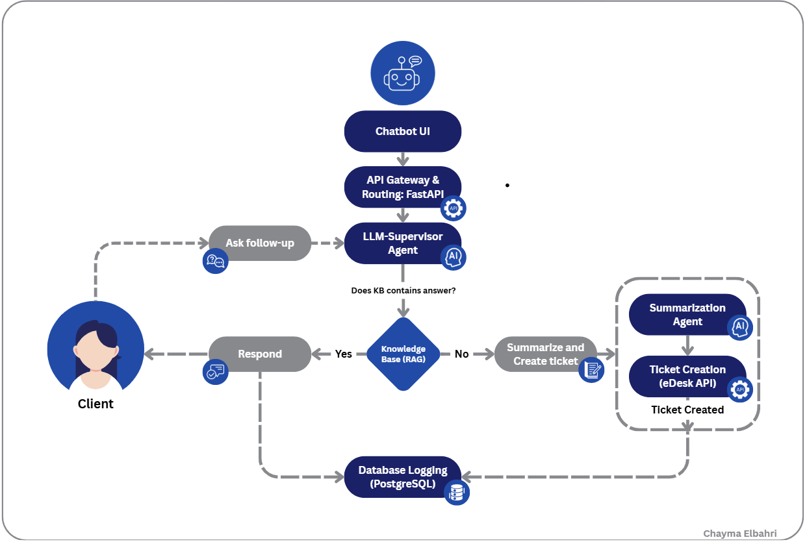

# Marathon-Support-Agent

## Overview

**Marathon-Support-Agent** is a modular, agent-driven support automation system built for endurance event platforms. It combines a conversational interface with retrieval-augmented generation (RAG), tool-based routing, and fallback escalation into structured support tickets.

The architecture leverages LangGraph for multi-agent state management, LangChain for LLM tooling, and FastAPI for API routing. Unresolved or ambiguous queries are converted into structured tickets via an LLM-based summarization pipeline and dispatched through an external ticketing API.

## System Architecture

The following diagram illustrates the message flow and system components:

## Features

- **Web-based Chat UI**: A lightweight frontend for user interaction with real-time feedback.
- **FastAPI Routing Layer**: Provides secure, asynchronous HTTP endpoints for chat communication and agent orchestration.
- **LLM-Supervisor Agent**: Central decision-making agent that performs conditional dispatching based on semantic analysis of user queries.
- **Retrieval-Augmented Generation (RAG)**: Integrates structured retrieval mechanisms to answer factual or transactional queries.
- **Summarization Agent**: Generates structured, JSON-formatted support tickets for escalation scenarios.
- **External Ticket Dispatch**: Integrates with the eDesk API to automatically create support tickets for unresolved queries.
- **Pluggable Logging Layer**: Designed for extensible request/response auditing and pipeline observability (implementation in progress).

## Processing Pipeline

1. A user submits a message via the chat interface.
2. The request is routed through the FastAPI gateway to the LLM-Supervisor agent.
3. The agent checks if the query can be resolved via retrieval (structured RAG layer).
   - If resolvable, the response is generated and returned.
   - If not, the message is passed to the Summarization Agent.
4. The Summarization Agent transforms the message into a structured format and submits it to the external support system via API.
5. System interaction logs are planned for future integration with a centralized logging sink.

## Component Overview

| Component             | Description                                                                      |
| --------------------- | -------------------------------------------------------------------------------- |
| Chat UI               | Web frontend for user interaction                                                |
| FastAPI Gateway       | HTTP layer with async routing and environment-secured endpoints                  |
| LLM-Supervisor Agent  | Evaluates user input and selects downstream tools or fallback mechanisms         |
| RAG Layer             | Structured retrieval and tool invocation for resolving factual queries           |
| Summarization Agent   | Converts ambiguous queries into structured support request payloads              |
| Ticketing API (eDesk) | Dispatches serialized support tickets to an external ticket management system    |
| Logging Layer         | _(Planned)_ Structured logging of message flow, ticket status, and system output |

## Technology Stack

- **LangGraph**: Declarative multi-agent state machine for tool orchestration and flow control.
- **LangChain**: Tool abstraction and prompt-based control over language model behavior.
- **FastAPI**: High-performance web framework for API construction with async support.
- **OpenAI / Anthropic**: LLM providers integrated via LangChain.
- **eDesk API**: RESTful interface for structured support ticket submission.
- **HTML/CSS/JavaScript**: Frontend chat interface with simple input-output binding.
